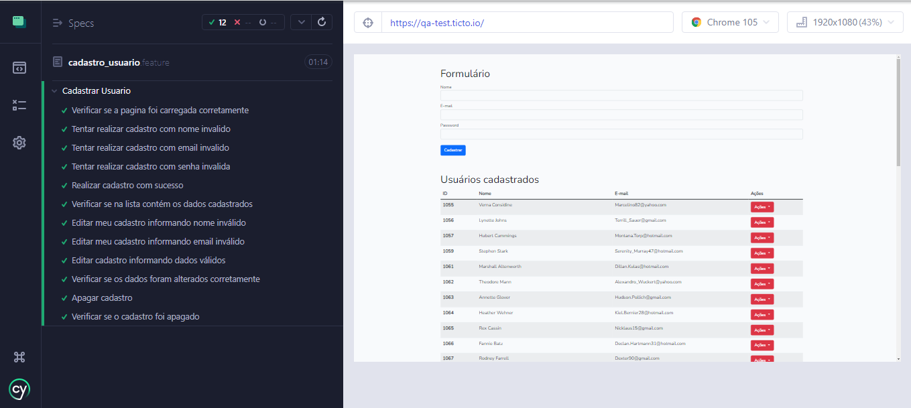

<h1 align="center">
  
  </h1>

<h2 align="center">
  Teste QA Ticto
</h2>

<p align="center">


</p>


<p align="center">
  <a href="#-projeto">Projeto</a>&nbsp;&nbsp;&nbsp;|&nbsp;&nbsp;&nbsp;
  <a href="#-como-rodar-o-projeto">Como rodar o projeto</a>&nbsp;&nbsp;&nbsp;|&nbsp;&nbsp;&nbsp;
  <a href="#-tecnologias">Tecnologias</a>&nbsp;&nbsp;&nbsp;&nbsp;&nbsp;&nbsp;
</p>

## 💻 Projeto

Projeto realizado para vaga de QA na Ticto. Nesse teste, foi realizado o seguindo os seguintes critérios:

- [x] Verificar se a página foi carregada.
- [x] Preencher nome, e-mail, e password inválidos e verifique a mensagem de erro.
- [x] Preencha nome, email e pasword válidos e cadastre.
- [x] Verificar se nome e e-mail foram os mesmos que você cadastrou.
- [x] Editar nome e email(em ações), colocando inválidos e verifique a mensagem de erro.
- [x] Preencha nome e e-mail válidos e confirme a edição.
- [x] Verifique se nome e e-mail foram alterados corretamente no GRID.
- [x] Apague o cadastro (em ações).
- [x] Verifique se o cadastro foi apagado.


### 📸 Imagens

**Relatório**


**Testes com Cypress**



## 🧭 Como rodar o projeto

**Clone este repositório**

```bash
git clone https://github.com/rogerioopaiva/teste_qa_ticto.git
```

**Acesse a pasta**

```bash
cd caminho_da_pasta (onde o projeto foi clonado)
```

**Instale as dependências**

```bash
npm install ou yarn install
```

**Execute a aplicação**

```bash
npm run cypress:run (para executar os testes)
npm run reportcypress:run (para gerar o relatório)
```

## 🚀 Tecnologias

Esse projeto foi desenvolvido com as seguintes tecnologias:

- [Cypress](https://www.cypress.io/)
- [FakerJS](https://fakerjs.dev/guide/)
- [Multiple Cucumber Html Reporter](https://www.npmjs.com/package/multiple-cucumber-html-reporter/)

